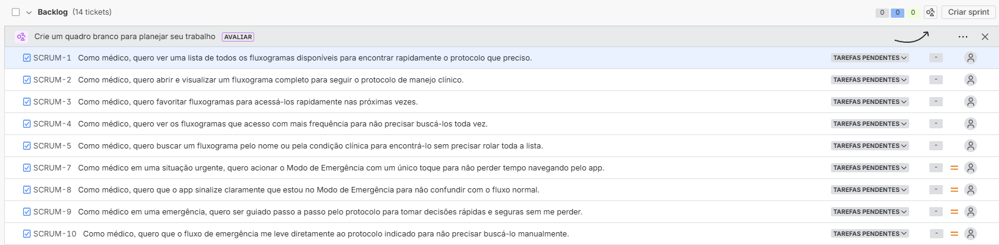
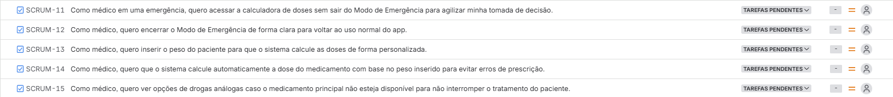
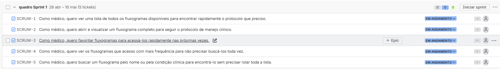

<h1 align="center">🕊️ ARCA Gênesis </h1>

  <em>Uma breve descrição do que o projeto</em>

  <a href="#">🌐 Acesse nosso site</a>

---
## 📖 Histórias Épicas

### Épico 1 - Acesso Rápido a Protocolos Clínicos

*"Como médico recém-formado, quero acessar fluxogramas de manejo clínico de forma rápida e organizada, para tomar decisões seguras durante minha prática médica sem depender de memorização."*

Abrange a biblioteca de fluxogramas, com seções de favoritos e mais acessados e visualização otimizada para uso em ambiente hospitalar (baixa latência, mobile-first).

---

### Épico 2 - Suporte à Decisão em Situações de Emergência

*"Como médico em uma situação de urgência pediátrica, quero acionar um modo de emergência que me direcione imediatamente ao protocolo e aos cálculos necessários, para agir com precisão e rapidez sem perder tempo navegando pelo sistema."*

Abrange o Modo de Emergência com acesso em um toque, fluxo guiado e simplificado, e integração direta com a calculadora de doses.

---

### Épico 3 - Cálculo Seguro de Doses e Medicações

*"Como médico recém-formado, quero calcular doses de medicamentos pediátricos com base no peso do paciente e visualizar drogas análogas disponíveis, para prescrever com segurança e reduzir erros de medicação."*

Abrange a calculadora de peso, sugestão de drogas análogas, e apresentação clara dos resultados com base nos protocolos.

---

## ⬜ Backlog

---

## 🗂️ Quadro de Sprints

Cada sprint tem duração de **2 semanas**. As histórias épicas são desenvolvidas de forma sequencial ao longo das sprints.

---

## Sprint 1  [26/04] -> [10/05] 

---

## Sprint 2  [10/05] -> [24/05] 
[quadro sprint 2]

---

## Sprint 3  [24/05] -> [07/06] 
[quadro sprint 3]

---
## 👥 Equipe do Projeto

| [ Adrielly Perrini](https://github.com/perriniadrielly-http) | [ Beatriz Loyola](https://github.com/beatrizloyola) | [ Celina Cavalcanti](https://github.com/usuario3) | [ Daniel Donnaire](https://github.com/DanDdC) | [ Julia Calado](https://github.com/juliatenoriocalado) |
| :---: | :---: | :---: | :---: | :---: |
| [ Kelwin Karan](https://github.com/kev-karan) | [ Luiza Costa](https://github.com/Luiza029) | [ Pedro Bedor](https://github.com/pedrovcb) | [ Rafael Carrilho](https://github.com/usuario9) | [ Vtóriai Gabrielle](https://github.com/vitoriaduran) |